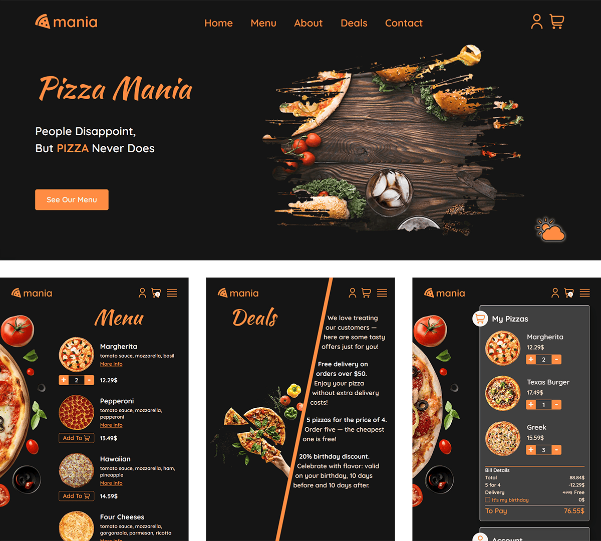

# 🍕 PIZZA MANIA

A responsive pizza delivery website built with modern web technologies. It includes pages for Home, Menu, About, Deals, Contact, Cart, and a custom 404 Error page.

🔗 **Live demo:** [pizza-mania-bice.vercel.app](https://pizza-mania-bice.vercel.app/)

🎨 **Design inspired by:** [Dipika Goldar on Figma](https://www.figma.com/community/file/1184172142545790709/pizza-website)

---

## 🚀 Tech Stack

- [**Next.js**](https://nextjs.org/) – The React framework for production.
- [**TypeScript**](https://www.typescriptlang.org/) – Type-safe code with better tooling support.
- [**Zustand**](https://zustand-demo.pmnd.rs/) – Lightweight state management for React.
- [**Decimal.js**](https://www.npmjs.com/package/decimal.js) – Arbitrary-precision arithmetic for money calculations.
- [**SASS (SCSS Modules)**](https://sass-lang.com/) – For component-based and responsive styling.

---

## ✨ Features

- **Responsive Design** – Works well on desktops, tablets, and mobile devices.
- **Interactive Cart Page** – Simulated ordering system with:
  - **Every fifth cheapest pizza free**
  - **Birthday deal: 20% off total price**
  - **Free delivery for orders over $50**
- **Scroll Animation** – A rotating pizza image appears on the Menu and Cart pages (visible in browsers that support the `animation-timeline` CSS property, like Chrome and Edge).
- **Theme Switcher** – An animated light/dark mode toggle available on the Home page.
